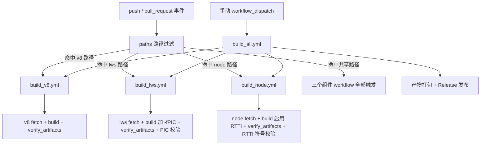
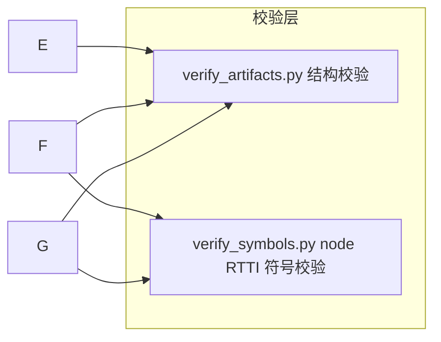

# 目标CI构建完整通过

Feature Name: ci-build-complete
Updated: 2026-08-21

## Description

本方案为 GodotJS-Dependencies 构建仓库建立一套"组件级独立验证 + 完整构建确认"的 CI 体系，使 v8、lws、node 三个依赖库都能分别构建通过，并满足两个关键产物约束：

1. lws 的 Linux 静态库以 `-fPIC` 编译，保证可被下游嵌入到共享库。
2. libnode 静态库保留 `v8::ValueSerializer::Delegate` 与 `v8::ValueDeserializer::Delegate` 两个类的 RTTI 类型信息符号，保证下游继承这两个类的代码可正常链接。

CI 触发策略：`push`/`pull_request` 按路径过滤，只触发改动命中的组件；`build_all.yml` 保持手动 `workflow_dispatch` 触发，作为发布前的完整构建确认。

## Architecture





## Components and Interfaces

### 1. 组件触发路径（workflow 变更）

在 `build_v8.yml`、`build_lws.yml`、`build_node.yml` 的 `on:` 中新增 `push`（main 分支）与 `pull_request` 触发器，并各自附带 `paths` 过滤。`workflow_dispatch`、`workflow_call` 保持不变。

| 组件 workflow | 组件专属路径 | 共享路径（触发全部组件） |
|---|---|---|
| `build_v8.yml` | `.github/workflows/build_v8.yml`、`.github/actions/v8/**`、`config/v8/**` | `scripts/verify_artifacts.py`、`scripts/expected_platforms.py`、`scripts/verify_symbols.py`、`.github/actions/upload/**`、`.github/workflows/build_all.yml` |
| `build_lws.yml` | `.github/workflows/build_lws.yml`、`.github/actions/lws/**` | 同上 |
| `build_node.yml` | `.github/workflows/build_node.yml`、`.github/actions/node/**`、`scripts/node/**` | 同上 |

配置示例（以 v8 为例）：

```yaml
on:
  push:
    branches: [ main ]
    paths:
      - '.github/workflows/build_v8.yml'
      - '.github/actions/v8/**'
      - 'config/v8/**'
      - 'scripts/verify_artifacts.py'
      - 'scripts/expected_platforms.py'
      - 'scripts/verify_symbols.py'
      - '.github/actions/upload/**'
      - '.github/workflows/build_all.yml'
  pull_request:
    paths:
      # 与 push 相同
```

### 2. 自动触发时的输入默认值

`push`/`pull_request` 触发时 `inputs` 与 `github.event.inputs` 均为空，因此各 build job 的版本输入需追加兜底默认值，避免 fetch 阶段因空版本号失败：

- `build_v8.yml` build job：`V8_VERSION: ${{ inputs.v8_version || github.event.inputs.v8_version || '13.5.119' }}`
- `build_node.yml` build job：`NODE_VERSION: ${{ inputs.node_version || github.event.inputs.node_version || 'v24.x' }}`
- `platforms` 保持默认空串（等价于构建该组件全部平台），自动触发即为该组件全量验证。

### 3. lws Linux 构建加 -fPIC

文件：`.github/actions/lws/build/action.yml`（linux 分支，x86_64 与 arm64 两条 cmake 命令）

在 linux 分支的两次 `cmake` 配置命令中增加 `-DCMAKE_POSITION_INDEPENDENT_CODE=ON`，由 CMake 统一为 C/C++ 添加 `-fPIC`：

```bash
cmake -DBUILD_SHARED_LIBS=OFF -DLWS_WITH_SSL=0 -DCMAKE_BUILD_TYPE=Release \
  -DCMAKE_POSITION_INDEPENDENT_CODE=ON ..
```

仅改动 linux 分支；macos/windows/android/ios 分支维持现状。

### 4. libnode 启用 RTTI

新增脚本 `scripts/node/patch_rtti.py`，在 node 源码 fetch 完成、`./configure` 之前执行（bash 与 pwsh 平台均通过 `python` 调用，保持单份实现）。职责：

- 读取 `<node_root>/common.gypi`。
- 将 POSIX 分支 `cflags_cc` 列表中的 `'-fno-rtti',` 替换为 `'-frtti',`（覆盖默认关闭 RTTI 的构建配置，node 源码编译不受影响，产物开启 RTTI）。
- 将 Windows Release 配置中 `'RuntimeTypeInfo': 'false',` 替换为 `'true',`（等价 `/GR`）。
- 采用 fail-closed 校验：若未找到预期模式（上游 common.gypi 布局变化），立即报错退出，不允许静默跳过。

调用位置：`build-linux.sh`、`build-macos.sh`、`build-android.sh`、`build-ios.sh`、`build-ohos.sh`、`build-windows.ps1` 中紧邻 `apply_icu_profile.sh` / ICU 复制步骤之后、`./configure` 之前，追加：

```bash
python3 "$WORKSPACE/Scripts/scripts/node/patch_rtti.py" "$PWD"
```

Windows（`build-windows.ps1`）对应：

```powershell
python "$Workspace\Scripts\scripts\node\patch_rtti.py" (Get-Location)
```

说明：macOS / iOS 的 gyp 配置未在 `cflags_cc` 中施加 `-fno-rtti`（xcode_settings 的 RTTI 项在 make generator 下不生效），通常默认已带 RTTI，补丁对这些平台是幂等空操作；最终是否产出符号由第 5 节校验兜底。

### 5. 符号与 PIC 强制校验

新增脚本 `scripts/verify_symbols.py`，作为 CI 强制门槛，校验失败即组件构建失败。接口与既有 `verify_artifacts.py` 风格一致，均基于 `--root` + `--platform`/`--arch`。

**lws PIC 校验（仅 linux 平台）：**

```bash
python3 Scripts/scripts/verify_symbols.py lws --root staging/lws --platform linux --arch x86_64
```

实现方式：定位 `libwebsockets.a` 后，用 `$CC`（linux arm64 为交叉编译器）执行共享库链接冒烟测试：

```bash
"${CC:-cc}" -shared -fPIC \
  -Wl,--whole-archive <libwebsockets.a> -Wl,--no-whole-archive \
  -pthread -lm -ldl -o /dev/null
```

非 PIC 对象会使链接器报 `relocation R_X86_64_32 ... can not be used when making a shared object; recompile with -fPIC` 之类错误，脚本据此判定失败。

**node RTTI 符号校验（全部平台）：**

```bash
python3 Scripts/scripts/verify_symbols.py node --root staging/libnode --platform linux --arch x86_64
```

- Linux/macOS/Android/iOS/OHOS：`nm -C <libnode.a>` 后断言同时存在
  - `typeinfo for v8::ValueSerializer::Delegate`
  - `typeinfo for v8::ValueDeserializer::Delegate`
- Windows：使用 VS 工具链的 `dumpbin /symbols <libnode.lib>`，断言输出中出现 `v8::ValueSerializer::Delegate` 与 `v8::ValueDeserializer::Delegate` 相关 RTTI/vftable 符号；`dumpbin` 不可用时直接判定失败（fail-closed）。

**接入位置：**

- `.github/actions/lws/build/action.yml`：linux 分支在既有 `verify_artifacts.py` 之后追加 `verify_symbols.py lws` 调用。
- `.github/actions/node/build/action.yml`：unix 与 windows 分支在既有 `verify_artifacts.py` 之后追加 `verify_symbols.py node` 调用。

### 6. 完整构建确认（build_all.yml）

保持 `build_all.yml` 仅含 `workflow_dispatch`，不新增自动触发。其内部已通过 `workflow_call` 复用三个组件 workflow，并在 publish job 中执行打包、`verify_artifacts.py --full`、`write_node_metadata.py` 与 Release 发布；本方案不改变其结构与输入。

## Data Models

### 路径过滤 → 组件映射

| 触发来源 | 命中的路径前缀 | 触发的 workflow |
|---|---|---|
| push / PR | `config/v8/**`、`.github/actions/v8/**` | `build_v8.yml` |
| push / PR | `.github/actions/lws/**` | `build_lws.yml` |
| push / PR | `scripts/node/**`、`.github/actions/node/**` | `build_node.yml` |
| push / PR | 共享脚本 / upload action / build_all.yml | 三个组件 workflow 全部 |

### 符号校验预期

| 组件 | 平台 | 校验手段 | 预期符号 |
|---|---|---|---|
| lws | linux x86_64/arm64 | `-shared` 链接冒烟测试 | 链接成功（无文本重定位错误） |
| node | unix 平台 | `nm -C libnode.a` | `typeinfo for v8::ValueSerializer::Delegate`、`typeinfo for v8::ValueDeserializer::Delegate` |
| node | windows | `dumpbin /symbols libnode.lib` | 两个 Delegate 类的 RTTI/vftable 符号 |

## Correctness Properties

1. 组件级构建通过（fetch 成功、`verify_artifacts.py` 通过、`verify_symbols.py` 通过）是该组件产物可发布的前置条件。
2. 只有 `build_all.yml` 具备发布能力；其 publish job 依赖三个组件均 success（或未运行组件按条件跳过），任一组件失败则整体不发布。
3. lws Linux 产物必须通过共享库链接冒烟测试；任一对象含文本重定位即失败。
4. libnode 产物必须同时含两个 Delegate 类的 typeinfo 符号；任一缺失即失败。
5. `patch_rtti.py` 与 `verify_symbols.py` 均为 fail-closed：上游布局变化导致无法识别时显式失败，不静默放行。

## Error Handling

| 场景 | 处理 |
|---|---|
| push/PR 触发但版本输入为空 | build job env 兜底默认版本（v8=13.5.119、node=v24.x），避免空版本 fetch 失败 |
| `patch_rtti.py` 找不到预期 gyp 模式 | 脚本报错退出，node 构建失败，提示人工核对上游 common.gypi 布局 |
| lws 产物含非 PIC 对象 | 链接冒烟测试失败，lws 构建失败，错误信息带 `recompile with -fPIC` 指引 |
| libnode 缺少 Delegate typeinfo 符号 | `verify_symbols.py` 报缺失符号清单，node 构建失败 |
| Windows 无 `dumpbin` | `verify_symbols.py` 直接失败，提示在 VS 开发环境运行 |
| `build_all.yml` 中某组件失败 | publish job 条件不满足，不执行打包与发布；已成功组件的 artifact 保留可下载排查 |

## Test Strategy

1. **本地 act 验证触发**：使用仓库 README 中的 act 命令分别验证三个组件 workflow 在 push/PR 路径过滤下的触发行为；确认改动共享脚本会触发三个组件。
2. **lws PIC 校验单测**：在本地以 `-fPIC` 编译 libwebsockets 冒烟，运行 `verify_symbols.py lws` 确认通过；再用不带 `-fPIC` 的库反向验证脚本会失败。
3. **node RTTI 校验单测**：对开启 RTTI 的 `libnode.a` 运行 `verify_symbols.py node` 确认符号存在；对关闭 RTTI 的库反向验证脚本失败。
4. **patch_rtti.py 幂等与 fail-closed**：对 linux 与 windows 两种 common.gypi 布局分别执行，确认替换生效；构造不含预期模式的文件，确认脚本报错。
5. **CI 全量回归**：三个组件 workflow 各跑一次完整平台矩阵（可先以 `platforms=linux` 冒烟），确认构建、结构校验、符号校验全绿；最后手动触发一次 `build_all.yml` 验证发布链路。

## References

[^1]: (Website) - [godotjs/GodotJS-Dependencies](https://github.com/godotjs/GodotJS-Dependencies)
[^2]: (Website) - [moluopro/libnode](https://github.com/moluopro/libnode)
[^3]: (Filename#L1) - [requirements.md](requirements.md)
